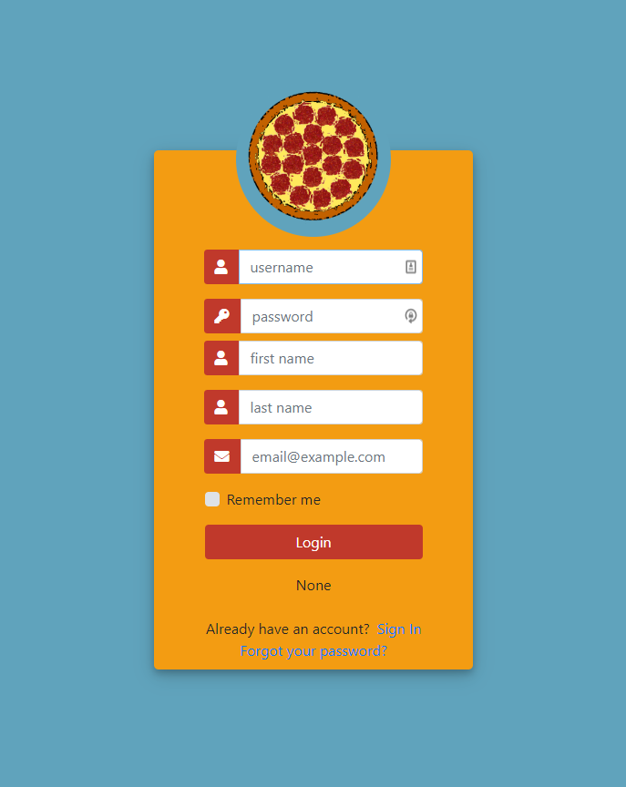
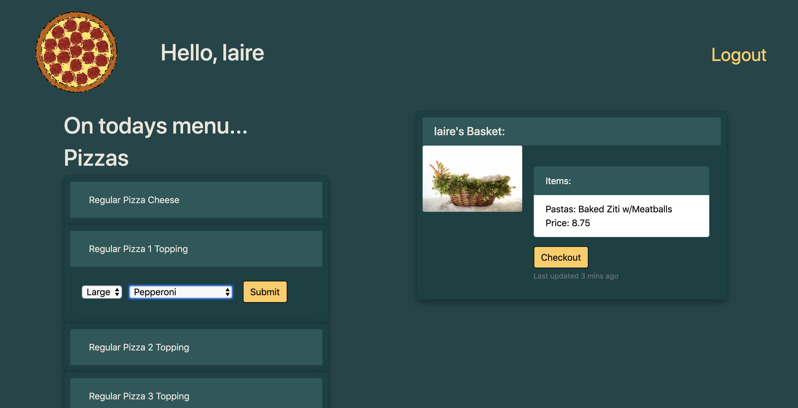
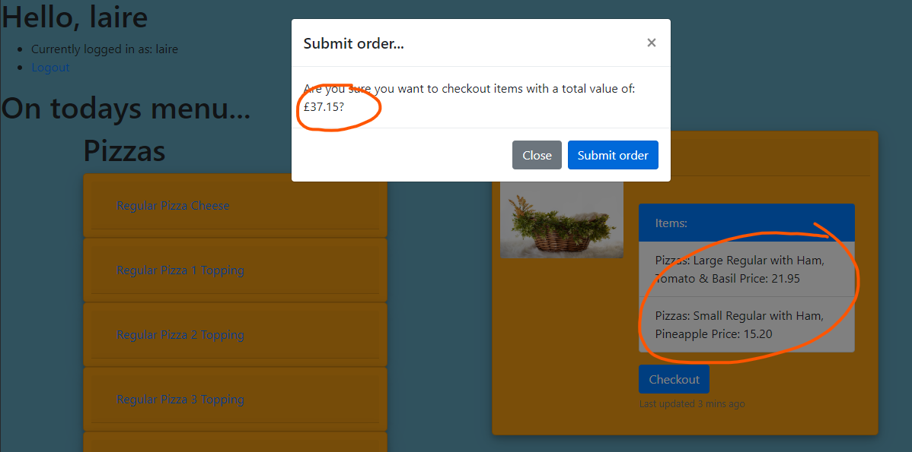

# Project PizzaShop

This is an example pizza shop website which allows you do order custom pizzas, subs, pastas, salads and platters of food!

You can intuitively add items to your basket and proceed through to checkout.

Register a user using the registration page and then login!

If you are an admin user you are able to add new items to the site through the Django admin panes as well as view and mark orders complete (personal touch) using the built-in admin page (which you will be taken to on login).

## Registration Screen


## Menu and ordering!


## Confirm your basket and checkout


## Admin panel - marking orders complete


### models.py
This file stores the model classes as used in the project. This sets out the data structure and inheritence for the ordering process.

Although these models could probably have been made more simple. I chose to use a more complicated data structure using lots of inheritence so that it would be much easier for an admin to add new items. In hindsight this probably wasn't neccesarry and it made some of my other application logic quite complex.

### views.py
This file holds the view functions for the application as well as some other custom functions which handle some data as called by the view functions.

### base.html
```user.html``` and ```admin.html``` inherit from this template. It basically just handles some imports.

### fancy_login.html / fancy_register.html
This is where a user lands directly after login, whether a normal user or an admin.### user.html

### user.html/admin.html
Here normal users can see the menu, admins can see placed orders from any user. All requests come back to this page except logout which returns the user to the login view.

Enjoy!